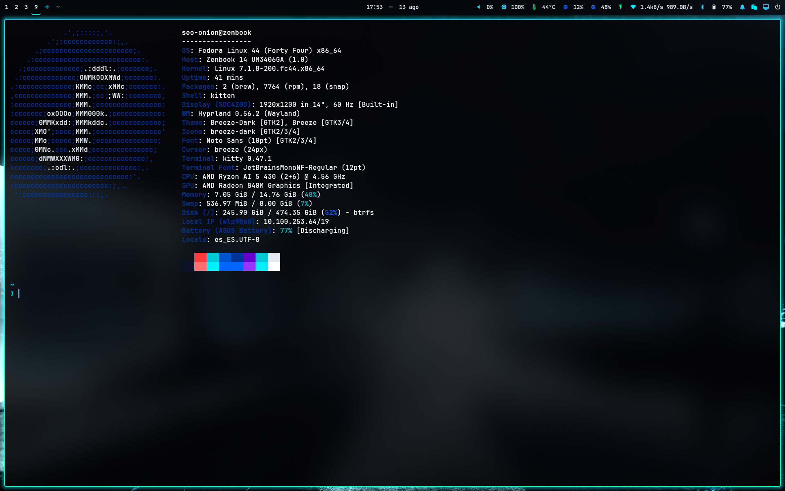
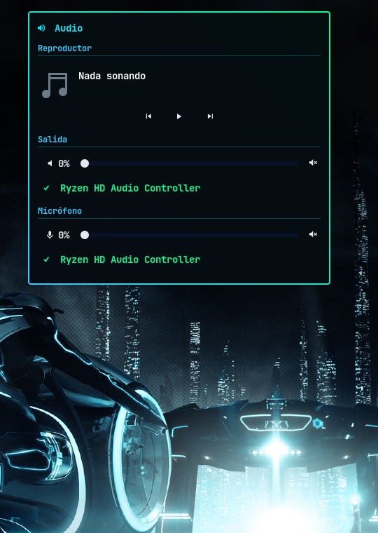
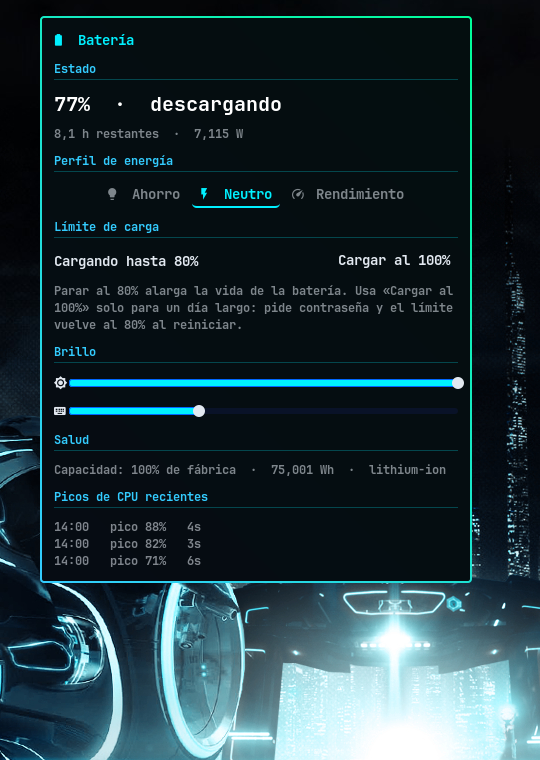
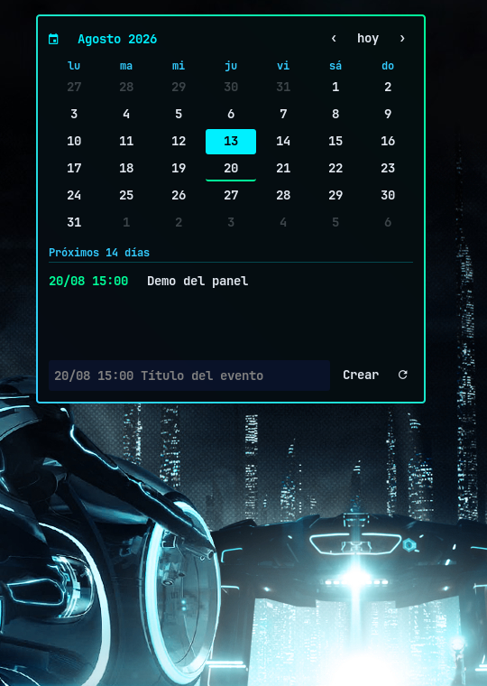
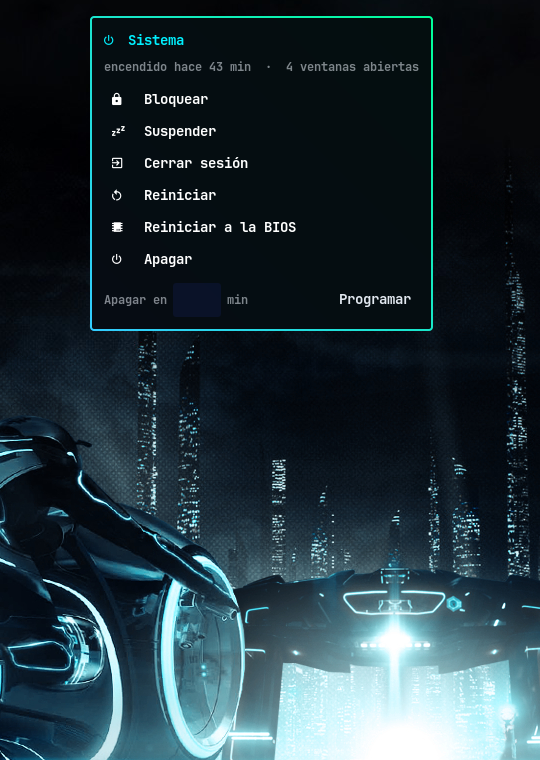
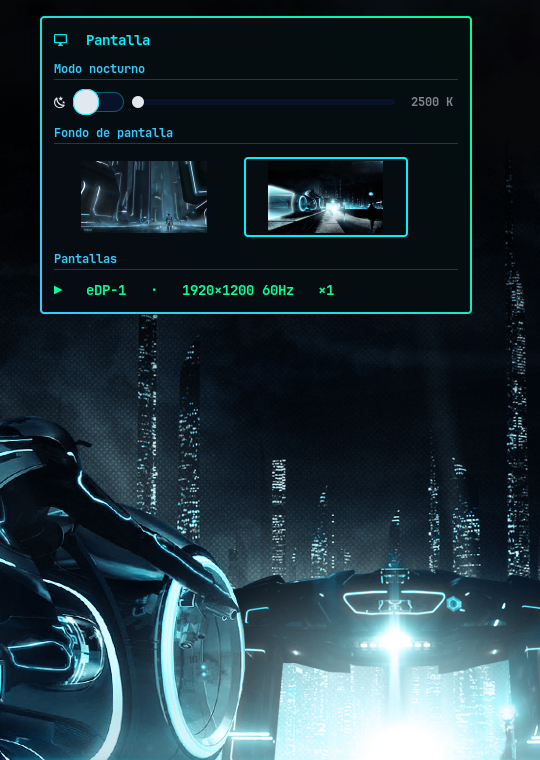
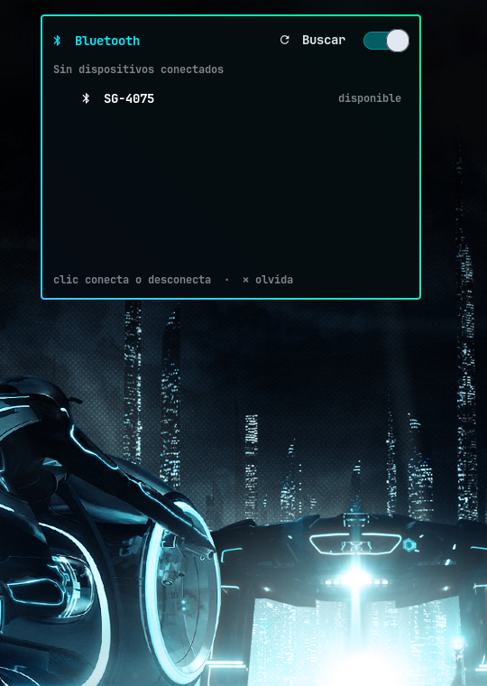

<div align="center">

# ⚡ Escritorio Tron — Hyprland + 7 paneles GTK propios

**Fedora · Hyprland 0.56 (config en Lua) · Waybar · GTK3 layer-shell · khal**



*Cada icono de la barra abre un panel propio, escrito en Python + GTK layer-shell
— la misma técnica que swaync — con tema Tron transversal.*

</div>

---

## Los paneles

Nada de menús dmenu: los 7 iconos de la waybar despliegan paneles que caen
desde la barra, centrados en el icono pulsado. Clic fuera cierra (superficie
cover-screen transparente), Esc cierra, segundo clic en el icono cierra.

| | |
|:---:|:---:|
|  |  |
| **Audio** — reproductor MPRIS con carátula, selector de salida/entrada, mezclador por app | **Batería** — consumo en vatios en vivo, perfiles tuned, límite de carga 80↔100, brillo, picos de CPU |
|  |  |
| **Calendario** — cuadrícula navegable + eventos khal, crear con sintaxis rápida, sync CalDAV | **Energía** — confirmación de segundo clic en lo destructivo, apagado programado, reinicio a BIOS |
|  |  |
| **Pantalla** — modo nocturno con slider de temperatura, selector de fondos por miniaturas, gestión de monitor externo | **Bluetooth** — conectar, emparejar, olvidar, batería de dispositivos |

También hay un panel de **Wi-Fi** (lista con señal, contraseña integrada con
ojo para mostrarla) — sin foto porque enseñaría los SSID del vecindario.

## Detalles que costaron sangre

- **Config de Hyprland en Lua** (0.56+): binds que son funciones de verdad —
  SUPER+Tab lleva el estado maximizado a la siguiente ventana, por ejemplo.
- **Borde degradado + esquinas redondeadas** en GTK CSS: dos fondos
  superpuestos con `background-clip`, porque `border-image` ignora el radius.
- Los **glifos Nerd Font van como escapes `\U000f...`** en el código: pegados
  como caracteres se corrompen (lección aprendida a las malas).
- El fondo de pantalla es un **symlink administrado por el panel de pantalla**:
  cambia con un clic en la miniatura y sobrevive reinicios.
- Auto-commit diario de esta config vía systemd user timer.

## Atajos principales

| Tecla | Acción |
|---|---|
| `SUPER` (solo) | Lanzador (Sherlock) |
| `SUPER+Q` / `SUPER+N` | Terminal / terminal en workspace vacío |
| `SUPER+F` / `SUPER+G` | Maximizar / pantalla completa total |
| `SUPER+Tab` | Ciclar — hereda el maximizado si lo hay |
| `SUPER+1-9` (+`SHIFT`) | Ir a workspace / mover ventana |
| `SUPER+V` | Flotar · `Print` captura · `F11` modo nocturno |

## Estructura

```
hypr/            config Lua, hyprlock, scripts/ (los 7 paneles + utilidades)
hypr/ESCRITORIO.md   ← la documentación de verdad: decisiones y trampas
waybar/          barra + DESIGN.md
sherlock/        lanzador (tema tron.css)
swaync/ kitty/   notificaciones y terminal
khal/            motor del calendario
```

## Restaurar

```sh
git clone git@github.com:seo-onion/dotfiles.git ~/.config-tmp && cp -rT ~/.config-tmp ~/.config
```

Paquetes: `hyprland` (COPR blacktau) `waybar` `swaync` `kitty` `copyq` `swaybg`
`wlsunset` `kanshi` `swayosd` `grim` `brightnessctl` `khal` `vdirsyncer`
`hyprlock` `gtk-layer-shell` `python3-gobject` `playerctl` — más
**JetBrainsMono Nerd Font** en `~/.local/share/fonts` y Sherlock compilado a
mano. Fondos en `~/Imágenes/Fondos/`. Para Google Calendar: copiar
`vdirsyncer/config.example` → `config` y seguir sus comentarios (**nunca
commitear el real**).
